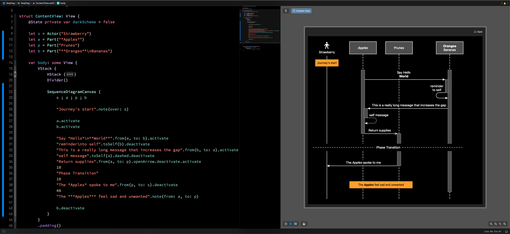

# swift-sequence-diagrams

**Note: this is in active development and not ready for use**

Swift DSL for sequence diagrams, with real-time rendering using Xcode previews.

This repo is for visibility only at this stage, in order to connect with anyone else
who is working on or interested in how to integrate text-based diagrams into swift
documentation.

See also: [Video showing the live preview experience](https://youtu.be/OlwzqgczfQE)
